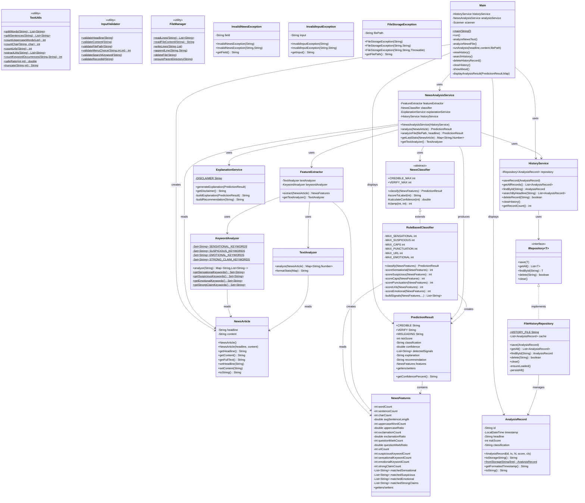

# TruthLens — Class Diagram

## Class Diagram (Mermaid)



---

## Inheritance Hierarchy

```
RuntimeException
  ├── InvalidNewsException
  ├── InvalidInputException
  └── FileStorageException

NewsClassifier (abstract)
  └── RuleBasedClassifier
      └── (future: MLClassifier)

IRepository<T> (interface)
  └── FileHistoryRepository
```
