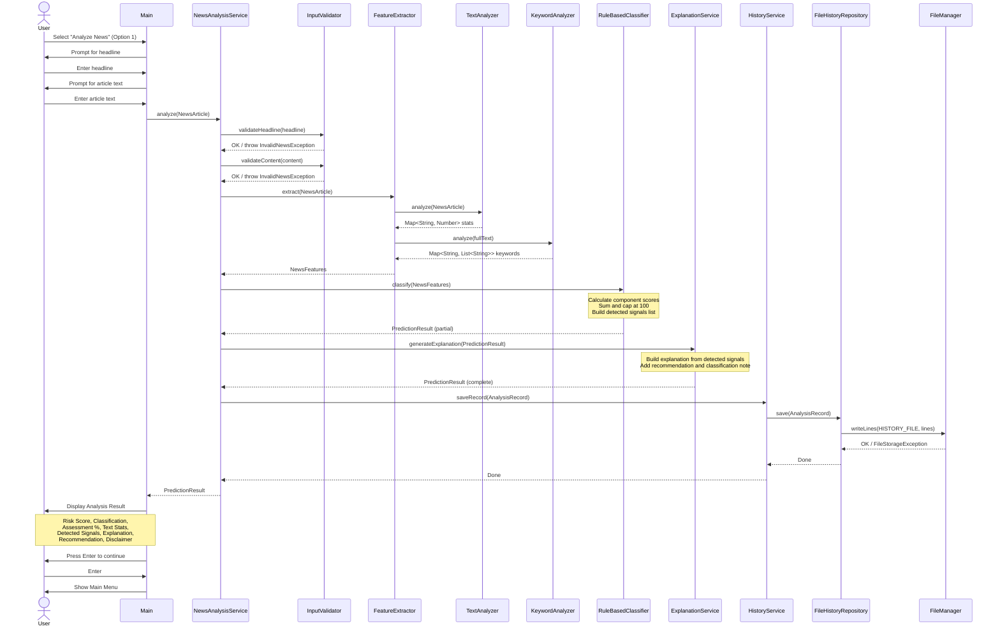
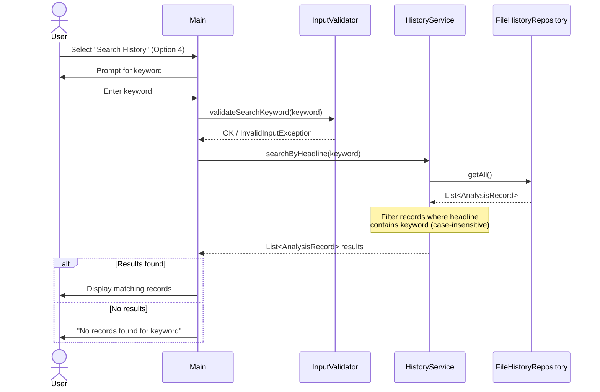
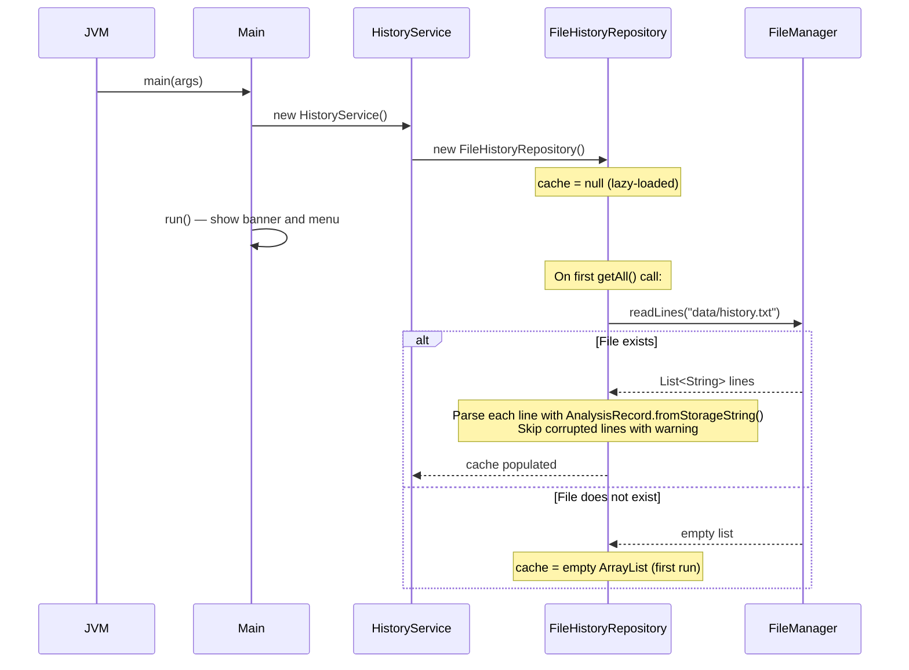

# TruthLens — Sequence Diagram

## Sequence: User Analyzes a News Article

```mermaid
sequenceDiagram
    actor User
    participant Main
    participant NewsAnalysisService
    participant InputValidator
    participant FeatureExtractor
    participant TextAnalyzer
    participant KeywordAnalyzer
    participant RuleBasedClassifier
    participant ExplanationService
    participant HistoryService
    participant FileHistoryRepository
    participant FileManager

    User->>Main: Select "Analyze News" (Option 1)
    Main->>User: Prompt for headline
    User->>Main: Enter headline
    Main->>User: Prompt for article text
    User->>Main: Enter article text
    Main->>NewsAnalysisService: analyze(NewsArticle)

    NewsAnalysisService->>InputValidator: validateHeadline(headline)
    InputValidator-->>NewsAnalysisService: OK / throw InvalidNewsException

    NewsAnalysisService->>InputValidator: validateContent(content)
    InputValidator-->>NewsAnalysisService: OK / throw InvalidNewsException

    NewsAnalysisService->>FeatureExtractor: extract(NewsArticle)
    FeatureExtractor->>TextAnalyzer: analyze(NewsArticle)
    TextAnalyzer-->>FeatureExtractor: Map<String, Number> stats
    FeatureExtractor->>KeywordAnalyzer: analyze(fullText)
    KeywordAnalyzer-->>FeatureExtractor: Map<String, List<String>> keywords
    FeatureExtractor-->>NewsAnalysisService: NewsFeatures

    NewsAnalysisService->>RuleBasedClassifier: classify(NewsFeatures)
    Note over RuleBasedClassifier: Calculate component scores<br/>Sum and cap at 100<br/>Build detected signals list
    RuleBasedClassifier-->>NewsAnalysisService: PredictionResult (partial)

    NewsAnalysisService->>ExplanationService: generateExplanation(PredictionResult)
    Note over ExplanationService: Build explanation from detected signals<br/>Add recommendation and classification note
    ExplanationService-->>NewsAnalysisService: PredictionResult (complete)

    NewsAnalysisService->>HistoryService: saveRecord(AnalysisRecord)
    HistoryService->>FileHistoryRepository: save(AnalysisRecord)
    FileHistoryRepository->>FileManager: writeLines(HISTORY_FILE, lines)
    FileManager-->>FileHistoryRepository: OK / FileStorageException
    FileHistoryRepository-->>HistoryService: Done
    HistoryService-->>NewsAnalysisService: Done

    NewsAnalysisService-->>Main: PredictionResult
    Main->>User: Display Analysis Result
    Note over Main,User: Risk Score, Classification,<br/>Assessment %, Text Stats,<br/>Detected Signals, Explanation,<br/>Recommendation, Disclaimer
    Main->>User: Press Enter to continue
    User->>Main: Enter
    Main->>User: Show Main Menu
```

---

## Sequence: User Searches History

```mermaid
sequenceDiagram
    actor User
    participant Main
    participant InputValidator
    participant HistoryService
    participant FileHistoryRepository

    User->>Main: Select "Search History" (Option 4)
    Main->>User: Prompt for keyword
    User->>Main: Enter keyword
    Main->>InputValidator: validateSearchKeyword(keyword)
    InputValidator-->>Main: OK / InvalidInputException

    Main->>HistoryService: searchByHeadline(keyword)
    HistoryService->>FileHistoryRepository: getAll()
    FileHistoryRepository-->>HistoryService: List<AnalysisRecord>
    Note over HistoryService: Filter records where headline<br/>contains keyword (case-insensitive)
    HistoryService-->>Main: List<AnalysisRecord> results

    alt Results found
        Main->>User: Display matching records
    else No results
        Main->>User: "No records found for keyword"
    end
```

---

## Sequence: Application Startup (History Load)

```mermaid
sequenceDiagram
    participant JVM
    participant Main
    participant HistoryService
    participant FileHistoryRepository
    participant FileManager

    JVM->>Main: main(args)
    Main->>HistoryService: new HistoryService()
    HistoryService->>FileHistoryRepository: new FileHistoryRepository()
    Note over FileHistoryRepository: cache = null (lazy-loaded)

    Main->>Main: run() — show banner and menu

    Note over FileHistoryRepository: On first getAll() call:
    FileHistoryRepository->>FileManager: readLines("data/history.txt")
    alt File exists
        FileManager-->>FileHistoryRepository: List<String> lines
        Note over FileHistoryRepository: Parse each line with AnalysisRecord.fromStorageString()<br/>Skip corrupted lines with warning
        FileHistoryRepository-->>HistoryService: cache populated
    else File does not exist
        FileManager-->>FileHistoryRepository: empty list
        Note over FileHistoryRepository: cache = empty ArrayList (first run)
    end
```
