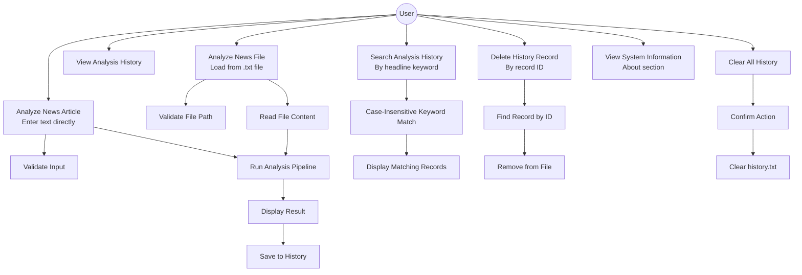

# TruthLens — Use Case Diagram

## Actors

- **User**: The person interacting with TruthLens via the command-line interface

## Use Case Diagram (Mermaid)

---

## Use Case Descriptions

### UC1 — Analyze News Article
- **Actor**: User
- **Trigger**: User selects option 1 from main menu
- **Precondition**: None
- **Steps**:
  1. User enters a headline
  2. User enters article text (two blank lines = done)
  3. System validates inputs
  4. System runs the analysis pipeline
  5. System displays risk score, classification, signals, explanation, recommendation
  6. System saves record to history
- **Postcondition**: Record stored in `data/history.txt`
- **Exceptions**: `InvalidNewsException` for empty/short input

### UC2 — Analyze News File
- **Actor**: User
- **Trigger**: User selects option 2 from main menu
- **Precondition**: A `.txt` file exists on the local filesystem
- **Steps**:
  1. User enters a headline
  2. User enters the file path
  3. System validates the file path
  4. System reads file content
  5. System runs same pipeline as UC1
- **Exceptions**: `InvalidInputException` for missing/unreadable file; `FileStorageException` on read error

### UC3 — View Analysis History
- **Actor**: User
- **Trigger**: User selects option 3
- **Steps**: System loads all records from file and displays them in a table
- **Postcondition**: None (read-only)

### UC4 — Search Analysis History
- **Actor**: User
- **Trigger**: User selects option 4
- **Steps**: User enters keyword; system returns all records with matching headlines
- **Exceptions**: `InvalidInputException` for empty keyword

### UC5 — Delete History Record
- **Actor**: User
- **Trigger**: User selects option 5
- **Steps**: User enters record ID; system deletes matching record and rewrites file
- **Exceptions**: Record not found message if ID invalid

### UC6 — Clear All History
- **Actor**: User
- **Trigger**: User selects option 6
- **Steps**: User confirms; system clears all records from memory and file
- **Precondition**: History has at least one record

### UC7 — View System Information
- **Actor**: User
- **Trigger**: User selects option 7
- **Steps**: System displays project name, purpose, technology, and OOP concepts demonstrated
