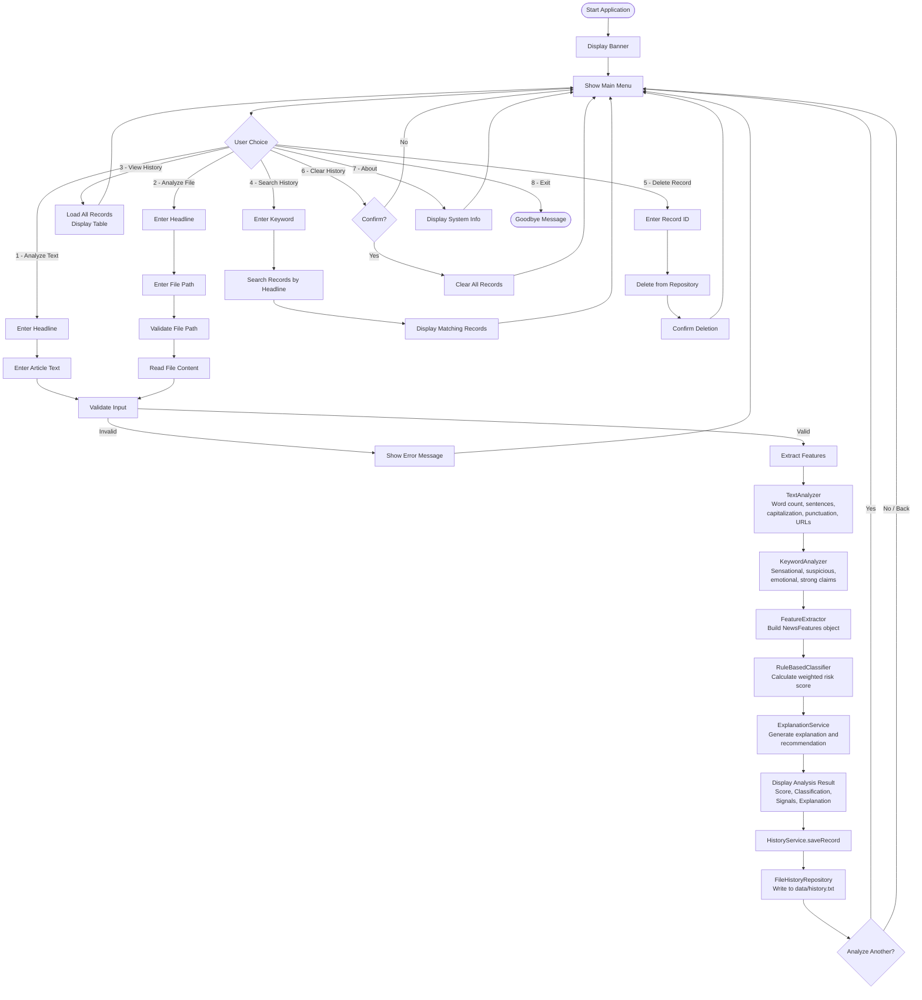
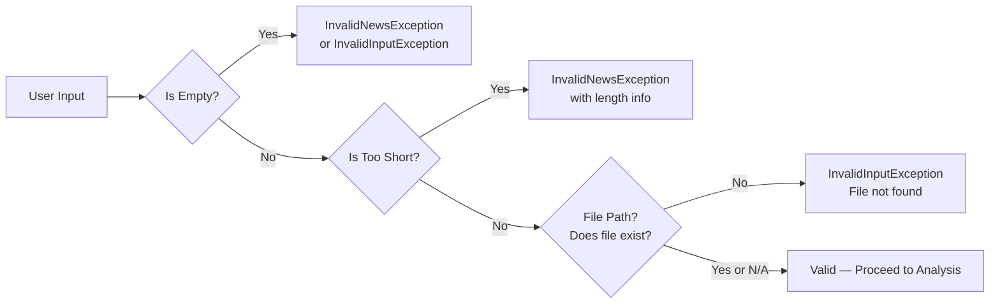
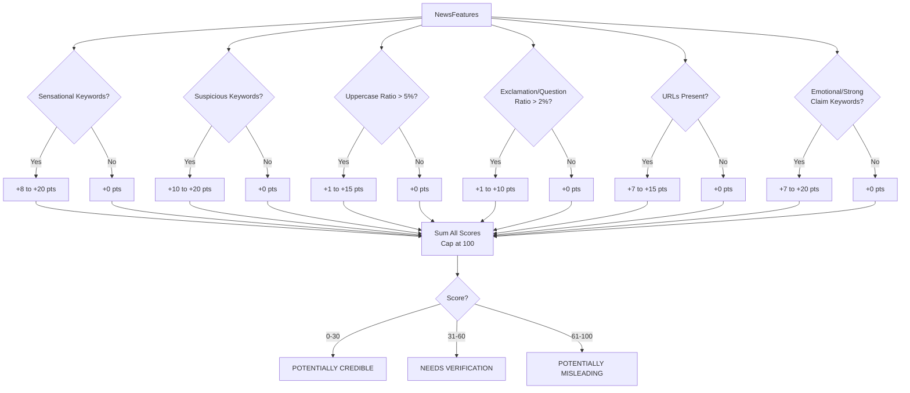

# TruthLens — Workflow Diagram

## Application Workflow

```mermaid
flowchart TD
    A([Start Application]) --> B[Display Banner]
    B --> C[Show Main Menu]
    C --> D{User Choice}

    D --> |1 - Analyze Text| E[Enter Headline]
    E --> F[Enter Article Text]
    F --> G[Validate Input]

    D --> |2 - Analyze File| H[Enter Headline]
    H --> I[Enter File Path]
    I --> J[Validate File Path]
    J --> K[Read File Content]
    K --> G

    G --> |Invalid| L[Show Error Message]
    L --> C

    G --> |Valid| M[Extract Features]
    M --> N[TextAnalyzer\nWord count, sentences,\ncapitalization, punctuation, URLs]
    N --> O[KeywordAnalyzer\nSensational, suspicious,\nemotional, strong claims]
    O --> P[FeatureExtractor\nBuild NewsFeatures object]

    P --> Q[RuleBasedClassifier\nCalculate weighted risk score]
    Q --> R[ExplanationService\nGenerate explanation and\nrecommendation]
    R --> S[Display Analysis Result\nScore, Classification,\nSignals, Explanation]
    S --> T[HistoryService.saveRecord]
    T --> U[FileHistoryRepository\nWrite to data/history.txt]
    U --> V{Analyze Another?}
    V --> |Yes| C
    V --> |No / Back| C

    D --> |3 - View History| W[Load All Records\nDisplay Table]
    W --> C

    D --> |4 - Search History| X[Enter Keyword]
    X --> Y[Search Records by Headline]
    Y --> Z[Display Matching Records]
    Z --> C

    D --> |5 - Delete Record| AA[Enter Record ID]
    AA --> AB[Delete from Repository]
    AB --> AC[Confirm Deletion]
    AC --> C

    D --> |6 - Clear History| AD{Confirm?}
    AD --> |Yes| AE[Clear All Records]
    AE --> C
    AD --> |No| C

    D --> |7 - About| AF[Display System Info]
    AF --> C

    D --> |8 - Exit| AG([Goodbye Message])
```

---

## Input Validation Flow

```mermaid
flowchart LR
    A[User Input] --> B{Is Empty?}
    B --> |Yes| C[InvalidNewsException\nor InvalidInputException]
    B --> |No| D{Is Too Short?}
    D --> |Yes| E[InvalidNewsException\nwith length info]
    D --> |No| F{File Path?\nDoes file exist?}
    F --> |No| G[InvalidInputException\nFile not found]
    F --> |Yes or N/A| H[Valid — Proceed to Analysis]
```

---

## Risk Scoring Workflow

```mermaid
flowchart TD
    A[NewsFeatures] --> B{Sensational Keywords?}
    B --> |Yes| B1[+8 to +20 pts]
    B --> |No| B2[+0 pts]
    
    A --> C{Suspicious Keywords?}
    C --> |Yes| C1[+10 to +20 pts]
    C --> |No| C2[+0 pts]
    
    A --> D{Uppercase Ratio > 5%?}
    D --> |Yes| D1[+1 to +15 pts]
    D --> |No| D2[+0 pts]
    
    A --> E{Exclamation/Question\nRatio > 2%?}
    E --> |Yes| E1[+1 to +10 pts]
    E --> |No| E2[+0 pts]
    
    A --> F{URLs Present?}
    F --> |Yes| F1[+7 to +15 pts]
    F --> |No| F2[+0 pts]
    
    A --> G{Emotional/Strong\nClaim Keywords?}
    G --> |Yes| G1[+7 to +20 pts]
    G --> |No| G2[+0 pts]

    B1 & B2 & C1 & C2 & D1 & D2 & E1 & E2 & F1 & F2 & G1 & G2 --> H[Sum All Scores\nCap at 100]
    
    H --> I{Score?}
    I --> |0-30| J[POTENTIALLY CREDIBLE]
    I --> |31-60| K[NEEDS VERIFICATION]
    I --> |61-100| L[POTENTIALLY MISLEADING]
```
